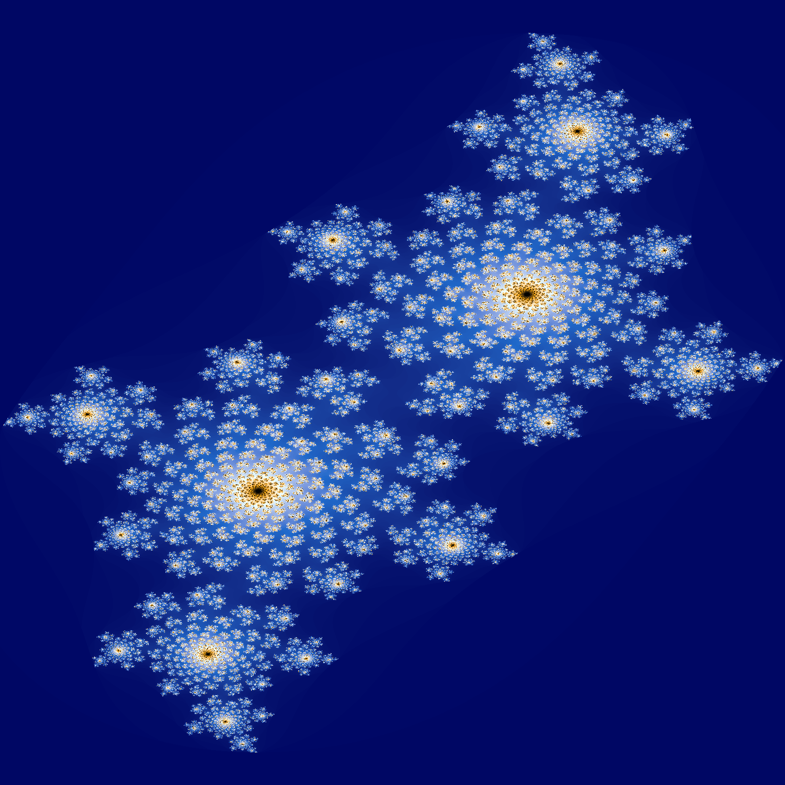
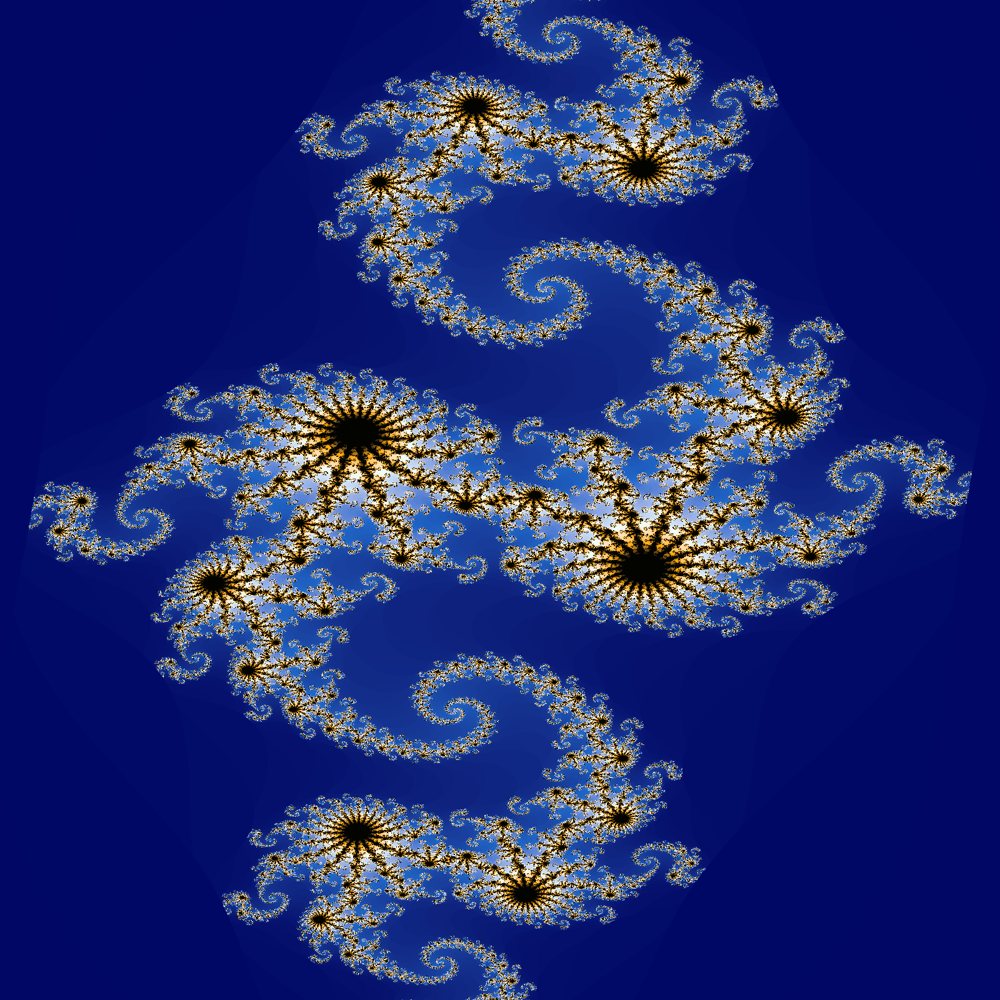
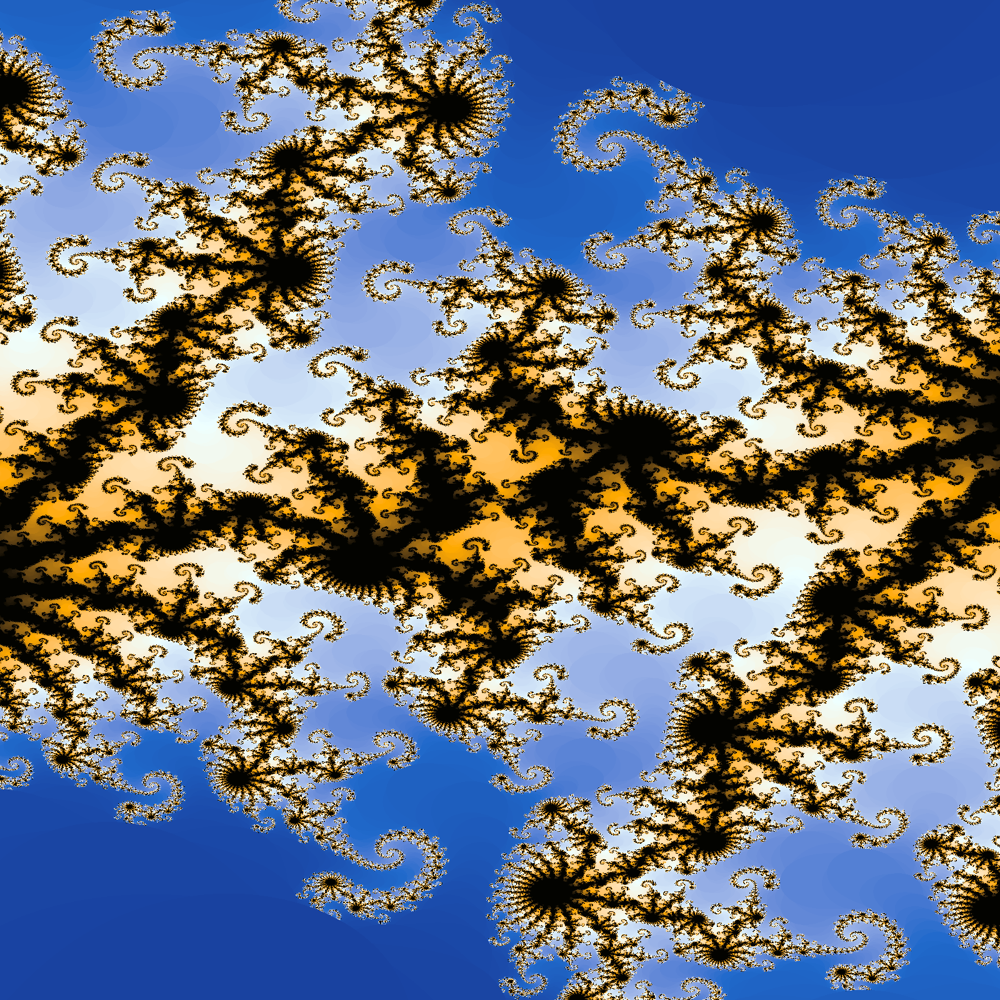

## Julia Set Generator Written In Golang 

This is a simple (naive) Julia Set generator written in Golang. The project utilizes concurrent workers to speed up processing speed. This project 
automatically generates an mp4 video using FFmpeg showing an animated julia set.

### Dependencies 
FFMPEG - video processing tool which can produce a video from a set of images

github.com/muesli/gamut - for generating color pallets.

github.com/u2takey/ffmpeg-go - for converting images into mp4's on the fly

### Needed Improvements
+ Improved efficiency
    + I'm sure there are a few ways to speed this project up computationally, aside from just throwing more CPU cores at it.

### Some Good Starting values 
Different julia sets can be created by using different values for the constant real and constant imaginary values, here are some good values to produce a few julia sets that are interesting to look at 

| cReal | cImaginary | Increment | endRange | Command                                                                                                  |
|-------|------------|-----------|----------|----------------------------------------------------------------------------------------------------------|
| -0.8  | 0.156      | 0.00001   | 0.0028   | julia -worker-count=5 -constant-real=-0.8 -constant-imaginary=0.156 -increment=0.00001 -end-range=0.0028 | 
| -0.4  | 0.6        | 0.0001    | .05      | julia -worker-count=5 -constant-real=-0.4 -constant-imaginary=0.6 -increment=0.0001 -end-range=0.05      |
| 0.280 | 0.01       | 0.00001   | 0.005    | julia -worker-count=5 -constant-real=0.280 -constant-imaginary=0.01 -increment=0.00001 -end-range=0.005  |

additional values can be found on various sites, such as wikipedia. 

### Tips And Tricks
  + The smaller the increment, the slower the animation
  + Each worker occupies one logical CPU core, an excessively large number of workers saturates the CPU and will slow down performance
  + Frame size directly correlates to the amount of work required, if you have performance problems consider a smaller frame size (default is 1600x1600).
    + square frame sizes are required
  + run the command with no arguments to get a default video
  + If you want to create really long or detailed animations, and do not have sufficient RAM you can pass the `-manual` flag
    + All png's will be placed in ./movie 
    + you can convert the images into an mp4 with the following commands 
      + Windows 
        + `ffmpeg -framerate 30 -i img%04d.png -c:v libx264 -pix_fmt yuv420p out.mp4`
      + Mac
        + `ffmpeg -framerate 30 -pattern_type glob -i '*.png' -c:v libx264 -pix_fmt yuv420p out.mp4`

### What is a julia set?

According to [Britannica](https://www.britannica.com/science/Julia-set),

```text
In general terms, a Julia set is the boundary between points in the complex number
plane or the Riemann sphere (the complex number plane plus the point at infinity)
that diverge to infinity and those that remain finite under repeated iteration of
some mapping (function). 
```

Julia set's are an interesting view into fractals and how mathematics and art can intersect. Even without an in depth 
appreciation for the mathematics at play, almost everyone can appreciate the resulting images / videos. Here are some examples,




